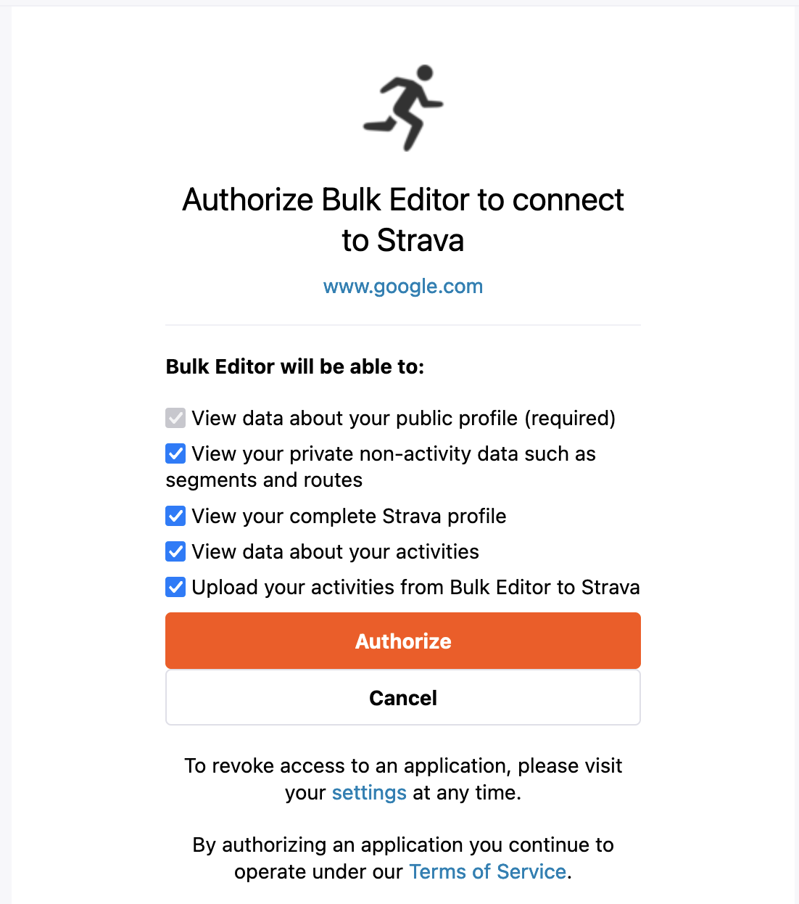

# Strava Bulk Update
 
This repository provides a powershell tool for interfacing with the Strava API to perform bulk updates on activities in your Strava profile.

The utility enables you to export your activities to a CSV file, where you can make edits as needed. Once your modifications are complete, you can re-import the updated activities back into Strava.

 ## Manual

### First: 
Follow the instructions on strava to create an app in your strava account.
https://developers.strava.com/docs/getting-started/

### Second:
With your CLIENT ID from the first step create an authorization code by calling this url.

http://www.strava.com/oauth/authorize?client_id=[CLIENT_ID]&response_type=code&redirect_uri=http://localhost/exchange_token&approval_prompt=force&scope=read_all,activity:write,activity:read,profile:read_all

You'll see this page - please confirm

### Third:
- Create the access token with the createToken.ps1 script
- run exportActivities.ps1 and Edit your activities in Excel (CSV)
- run importActivities.ps1 to upload your changes to strava

